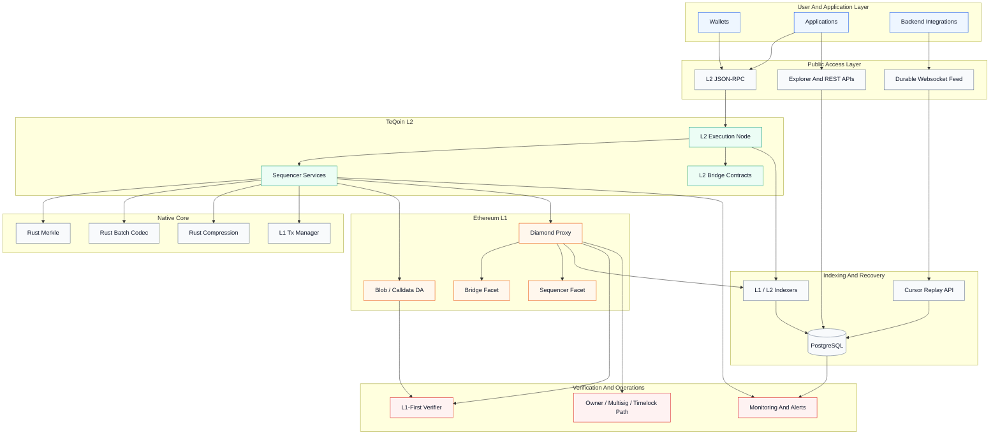
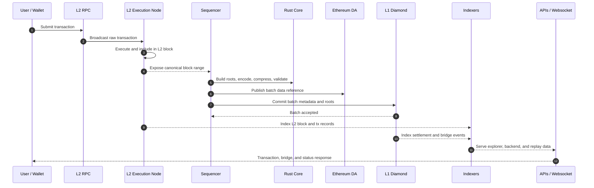
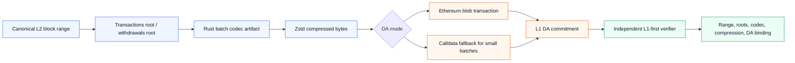
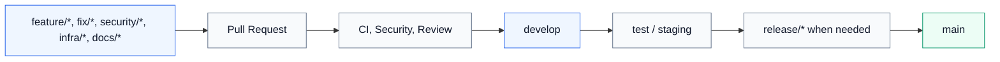

<p align="center">
  
</p>

<h1 align="center">TeQoin L2</h1>

<p align="center">
  Ethereum-aligned Layer 2 infrastructure for fast execution, secure bridging, canonical data availability, and developer-grade indexing.
</p>

<p align="center">
  <a href="https://github.com/0xakileet/TeQoin-l2/actions/workflows/ci.yml"></a>
  <a href="https://github.com/0xakileet/TeQoin-l2/actions/workflows/security.yml"></a>
  
  
</p>

---

## Overview

TeQoin is an EVM-compatible Layer 2 blockchain stack built around fast L2 execution, Ethereum L1 settlement, canonical batch data availability, structured bridge flows, and production-oriented developer APIs.

The repository contains the core sequencer services, Solidity contracts, indexer APIs, operational documentation, CI/security workflows, and references for the Rust native core used by batching, Merkle, compression, and proof-related pipelines.

## System At A Glance



## Core Pillars

| Pillar | Description | Main Areas |
| --- | --- | --- |
| L2 execution | EVM-compatible execution with short L2 block cadence and Ethereum-style tooling. | `teqoin-geth`, sequencer services |
| Batch commitments | Deterministic batch construction, Merkle roots, compression, codec validation, and L1 submission. | `sequencer/src/services`, `teqoin-core` |
| Ethereum DA | Batch data path through Ethereum blob DA, with calldata as a constrained fallback path. | DA services, `SequencerFacet` |
| Bridge lifecycle | L1 to L2 deposits, L2 to L1 withdrawals, challenge/finality windows, and indexed status. | `BridgeFacet`, L2 bridge contracts |
| Indexer APIs | Explorer, wallet, backend, bridge, websocket, replay, and metrics APIs. | `l2-indexer`, `sepolia-indexer` |
| Security workflow | CI, secret scanning, audit docs, branch discipline, and staged deployment guardrails. | `.github/`, `docs/` |

## Transaction And Batch Pipeline



## Bridge Lifecycle

```mermaid
flowchart TB
  classDef pending fill:#fff7ed,stroke:#ea580c,color:#0f172a
  classDef active fill:#eff6ff,stroke:#2563eb,color:#0f172a
  classDef done fill:#ecfdf5,stroke:#059669,color:#0f172a

  subgraph Deposit[L1 To L2 Deposit]
    D1[User deposits ETH or ERC-20 on L1]:::active
    D2[L1 listener stores deposit event]:::pending
    D3[Sequencer processes deposit on L2]:::active
    D4[L2 bridge credits ETH or wrapped token]:::done
    D5[Indexer exposes processed bridge context]:::done
    D1 --> D2 --> D3 --> D4 --> D5
  end

  subgraph Withdrawal[L2 To L1 Withdrawal]
    W1[User initiates withdrawal on L2]:::active
    W2[Withdrawal listener stores event]:::pending
    W3[Batch includes withdrawal root]:::active
    W4[L1 bridge queues withdrawal]:::pending
    W5[Challenge / finality window]:::pending
    W6[Finalizer releases funds on L1]:::done
    W1 --> W2 --> W3 --> W4 --> W5 --> W6
  end
```



## Data Availability And Verification



## Repository Map

| Area | Path | What Lives There |
| --- | --- | --- |
| Sequencer | `sequencer/` | Runtime services for deposits, withdrawals, batch submission, DA, signers, fee oracle, and monitoring. |
| Contracts | `sequencer/src/contracts/` | Diamond facets, L1 bridge logic, L2 bridge contracts, faucet, oracle, and fraud-proof foundations. |
| L2 indexer | `l2-indexer/` | REST APIs, websocket feed, bridge history, address pages, transaction views, stats, replay recovery. |
| L1 indexer | `sepolia-indexer/` | L1 bridge/event history service when included in the full operational checkout. |
| Rust core | `teqoin-core/` | Merkle, batch codec, compression, crypto, L1 transaction manager, and FFI foundations. |
| ABI files | `abi/` | Integration ABIs for frontend, backend, indexers, and tooling. |
| Faucet | `faucet/` | Faucet ABI, deployment notes, and integration references. |
| Verification | `verification/` | Contract verification inputs and deployment metadata. |
| Documentation | `docs/` | Architecture, audit scope, release process, branch strategy, operations, and security review material. |

## Development Workflow



| Branch | Role |
| --- | --- |
| `main` | Stable release branch. |
| `develop` | Integration branch for reviewed work. |
| `test` | Testnet/staging validation branch. |
| `feature/*` | Product, protocol, or service features. |
| `fix/*` | Bug fixes. |
| `security/*` | Security hardening and audit remediation. |
| `infra/*` | Infrastructure, monitoring, and operations. |
| `docs/*` | Documentation-only changes. |
| `release/*` | Release preparation and final validation. |

## Local Verification

```bash
./scripts/check-repo-hygiene.sh
npm ci --prefix sequencer && npm run build --prefix sequencer
npm ci --prefix l2-indexer && npm run build --prefix l2-indexer
cd teqoin-core && cargo fmt --all -- --check && cargo clippy --workspace --all-targets -- -D warnings && cargo test --workspace
cd sequencer && forge test
```

Some checks are optional depending on the checkout. CI is written to skip Rust, Foundry, or Docker checks when the corresponding project files are not present.

## Documentation Index

| Document | Purpose |
| --- | --- |
| `docs/ARCHITECTURE.md` | Full architecture, trust boundaries, and operational topology. |
| `docs/PROTOCOL_FLOWS.md` | Visual protocol lifecycle diagrams for transactions, batches, DA, bridge, websocket recovery, and fees. |
| `docs/CONTRACTS.md` | Smart contract map and high-risk review areas. |
| `docs/AUDIT_SCOPE.md` | External audit scope and expected deliverables. |
| `docs/SECURITY_REVIEW_GUIDE.md` | Security reviewer onboarding guide. |
| `docs/BRANCHING_STRATEGY.md` | Git workflow and branch rules. |
| `docs/ENVIRONMENT_SETUP.md` | Local environment setup. |
| `docs/RELEASE_CHECKLIST.md` | Release process checklist. |
| `docs/PRODUCTION_READINESS_CHECKLIST.md` | Production readiness tracking. |
| `docs/ROADMAP.md` | Engineering roadmap. |

## Security Baseline

| Area | Repository Policy |
| --- | --- |
| Secrets | Do not commit `.env`, private keys, keystores, cloud credentials, RPC keys, or API tokens. |
| RPC exposure | Public RPC should expose only safe JSON-RPC namespaces through controlled proxy layers. |
| Deployment | Production deployment is manual and must use GitHub Secrets or external secret management. |
| Review | Contract, sequencer, DA, bridge, and key-management changes require careful review. |
| Auditability | Architecture docs, contract map, audit scope, CI logs, and release checklists are maintained in-tree. |
