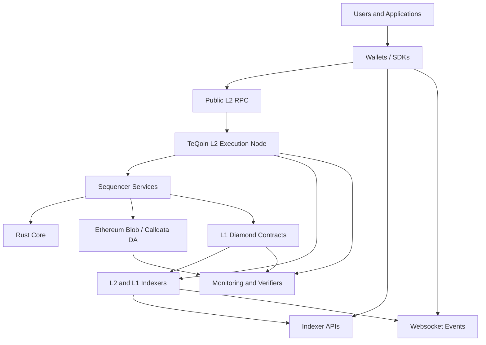
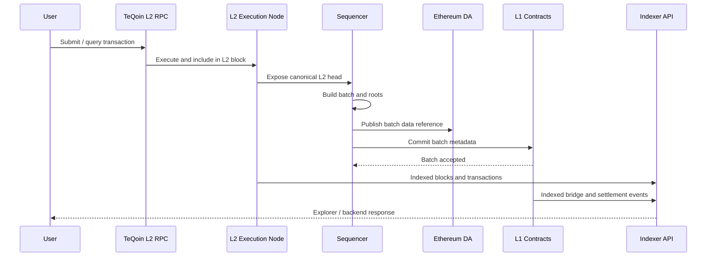
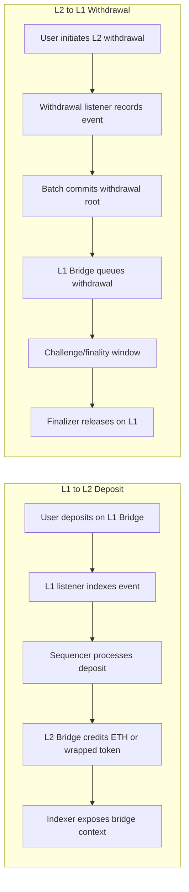
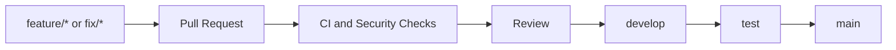

<p align="center">
  
</p>

<h1 align="center">TeQoin L2</h1>

<p align="center">
  Ethereum-aligned Layer 2 infrastructure for fast execution, secure bridging, scalable data availability, and developer-ready indexing.
</p>

<p align="center">
  <a href="https://github.com/0xakileet/TeQoin-l2/actions/workflows/ci.yml"></a>
  <a href="https://github.com/0xakileet/TeQoin-l2/actions/workflows/security.yml"></a>
</p>

---

## What Is TeQoin?

TeQoin is an EVM-compatible Layer 2 blockchain stack designed to provide fast, low-cost execution while keeping Ethereum L1 as the settlement and data-availability anchor.

The project brings together an L2 execution node, sequencer services, L1/L2 bridge contracts, Blob DA support, Rust-native cryptographic primitives, explorer/indexer APIs, websocket event recovery, and production-grade engineering workflows.

## Why TeQoin

| Capability | What It Provides |
| --- | --- |
| EVM compatibility | Ethereum-style accounts, contracts, transactions, RPC methods, and tooling. |
| Fast L2 execution | Short L2 block time for responsive wallets, apps, and payments. |
| Lower cost | Batching and L2 execution reduce the cost profile versus direct L1 execution. |
| Secure bridging | Structured L1/L2 bridge lifecycle for deposits, withdrawals, and settlement tracking. |
| Ethereum DA path | Blob DA and calldata DA support for L1-available batch data. |
| Developer APIs | Block, transaction, bridge, address, metrics, faucet, and websocket replay endpoints. |
| Rust performance core | Merkle, batch codec, compression, crypto, and transaction-manager primitives. |
| Professional workflow | CI, security checks, release discipline, audit docs, and operational runbooks. |

## Network Architecture



## Core Flow



## Bridge Flow



## Repository Layout

| Area | Path | Purpose |
| --- | --- | --- |
| Sequencer | `sequencer/` | L2 sequencing, L1 listeners, deposits, withdrawals, batch submission, DA, signer coordination. |
| Contracts | `sequencer/src/contracts/` | Diamond contracts, bridge facets, L2 contracts, faucet, oracle, and fraud-proof components. |
| L2 indexer | `l2-indexer/` | Public explorer/backend API for blocks, transactions, addresses, bridge history, metrics, and events. |
| L1 indexer | `sepolia-indexer/` | Sepolia/L1 indexing for bridge-side transaction history when included in the full checkout. |
| Rust core | `teqoin-core/` | Merkle, batch codec, compression, crypto, L1 transaction manager, and FFI foundations. |
| L2 geth | `teqoin-geth/` | TeQoin L2 geth implementation/build tree when included in the full checkout. |
| ABI files | `abi/` | Contract ABI files for frontend/backend integration. |
| Faucet | `faucet/` | Faucet ABI, deployment notes, and integration references. |
| Verification | `verification/` | Contract verification metadata and deployment artifacts. |
| Documentation | `docs/` | Architecture, security, audit scope, release process, production readiness, and operations. |

## Component Matrix

| Component | Language | Main Responsibility |
| --- | --- | --- |
| Sequencer services | TypeScript | Batch creation, L1/L2 coordination, deposits, withdrawals, DA, signers, monitoring. |
| L1 contracts | Solidity | Bridge custody, batch commitments, DA references, ownership, and upgrade logic. |
| L2 contracts | Solidity | L2 bridge, faucet, token, oracle, and protocol support contracts. |
| Rust core | Rust | Deterministic crypto/data primitives used by the batch and proof pipeline. |
| Indexers | TypeScript/PostgreSQL | Explorer APIs, bridge lifecycle, websocket replay, metrics, and analytics. |
| CI/CD | GitHub Actions | Build, test, audit, secret scanning, and manual deployment guardrails. |

## Developer Workflow



| Branch | Purpose |
| --- | --- |
| `main` | Stable release branch. |
| `develop` | Integration branch for reviewed work. |
| `test` | Staging/testnet validation branch. |
| `feature/*` | New product, protocol, or service features. |
| `fix/*` | Bug fixes. |
| `security/*` | Security hardening and audit remediation. |
| `infra/*` | Infrastructure, monitoring, and operations. |
| `docs/*` | Documentation-only work. |
| `release/*` | Release preparation. |

## Local Verification

```bash
./scripts/check-repo-hygiene.sh
npm ci --prefix sequencer && npm run build --prefix sequencer
npm ci --prefix l2-indexer && npm run build --prefix l2-indexer
cd teqoin-core && cargo fmt --all -- --check && cargo clippy --workspace --all-targets -- -D warnings && cargo test --workspace
cd sequencer && forge test
```

Some directories are optional depending on the checkout. CI skips optional Rust/Foundry/Docker checks when the corresponding project files are not present.

## Security And Operations

| Area | Policy |
| --- | --- |
| Secrets | Never commit `.env`, private keys, keystores, credentials, or cloud tokens. |
| RPC exposure | Public RPC should expose only safe read/write JSON-RPC namespaces. |
| Deployment | Deployment workflow is manual and guarded. |
| CI | Build, repository hygiene, secret scan, npm audit, cargo audit, and contract tests. |
| Audit docs | Architecture, contract map, audit scope, and security review guide are maintained in `docs/`. |

## Documentation

| Document | Purpose |
| --- | --- |
| `docs/ARCHITECTURE.md` | System architecture and protocol flow. |
| `docs/CONTRACTS.md` | Smart contract map and high-risk review areas. |
| `docs/AUDIT_SCOPE.md` | External audit scope and expected deliverables. |
| `docs/SECURITY_REVIEW_GUIDE.md` | Security reviewer onboarding guide. |
| `docs/BRANCHING_STRATEGY.md` | Git workflow and branch rules. |
| `docs/ENVIRONMENT_SETUP.md` | Local environment setup. |
| `docs/RELEASE_CHECKLIST.md` | Release process checklist. |
| `docs/PRODUCTION_READINESS_CHECKLIST.md` | Production-readiness tracking. |
| `docs/ROADMAP.md` | Engineering roadmap. |
