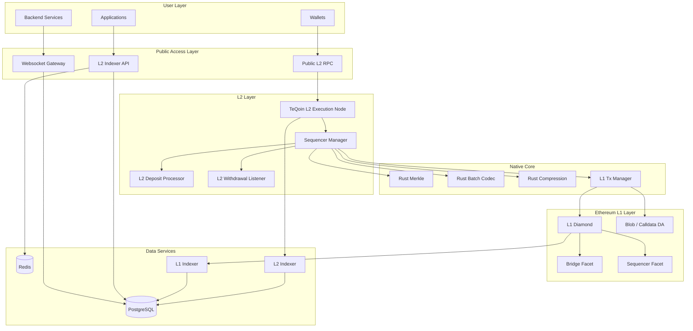
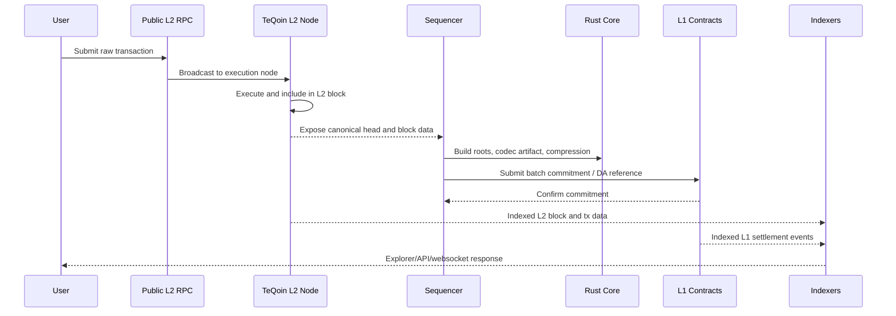
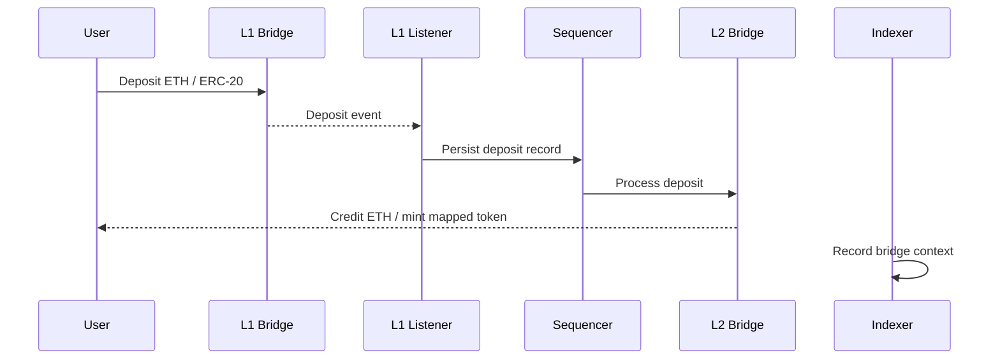
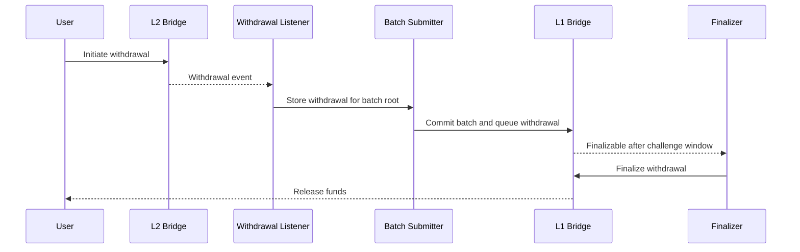
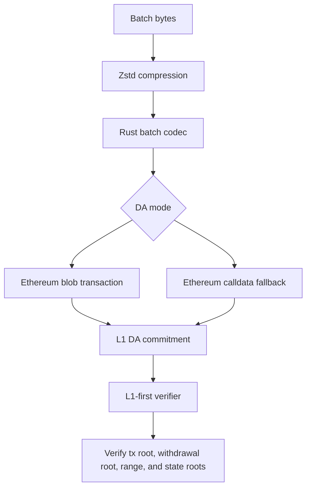
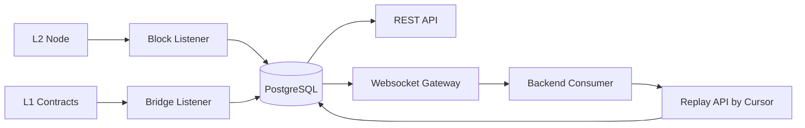
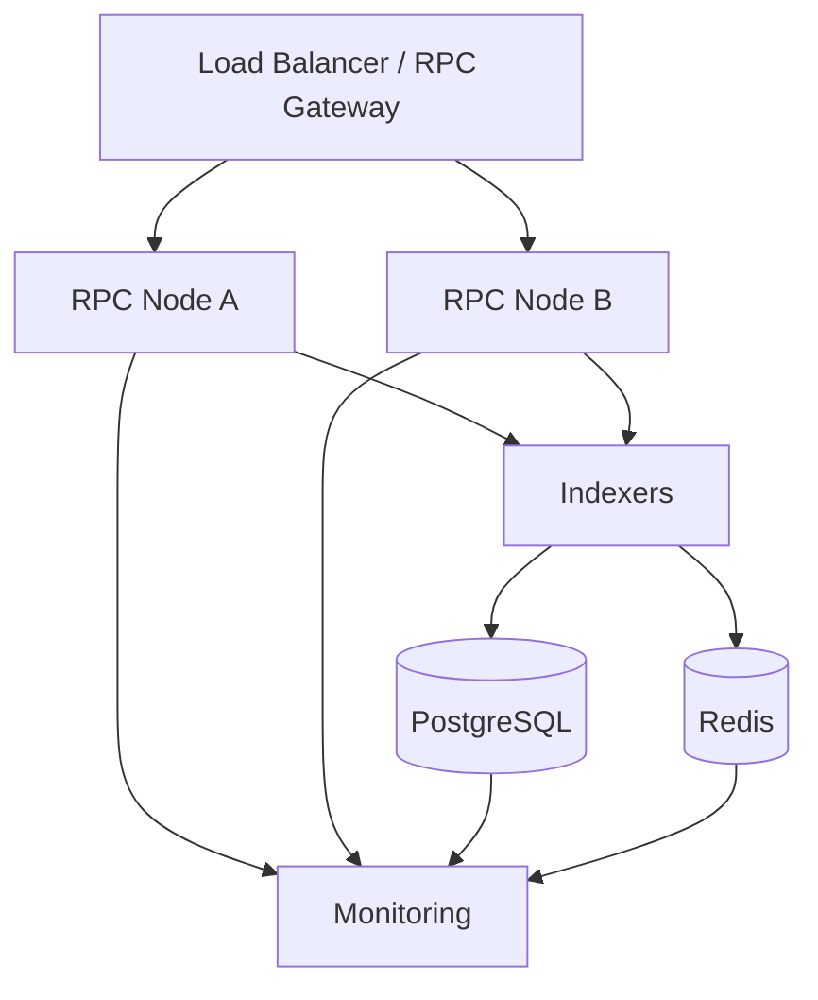

# TeQoin Architecture

This document maps the TeQoin L2 system for protocol engineers, infrastructure partners, auditors, backend developers, and frontend integrators.

## System Overview

## Layer Responsibilities

| Layer | Responsibility | Main Code Areas |
| --- | --- | --- |
| Public access | RPC, API, websocket, frontend/backend integration. | `l2-indexer`, `sepolia-indexer`, RPC proxy config |
| L2 execution | EVM-compatible block execution and state. | `teqoin-geth`, L2 runtime config |
| Sequencer | Batch planning, deposits, withdrawals, DA, signers, fee oracle, monitoring. | `sequencer/src/services` |
| L1 contracts | Bridge custody, batch commitments, DA references, finality and dispute foundations. | `sequencer/src/contracts/diamond` |
| Rust core | Deterministic Merkle, codec, compression, crypto, and L1 tx manager primitives. | `teqoin-core` |
| Indexing | Explorer APIs, bridge lifecycle, metrics, websocket replay, analytics. | `l2-indexer`, `sepolia-indexer` |
| Operations | Docker/systemd/nginx/Postgres/Redis/logging/alerts. | deployment config and runbooks |

## Transaction Lifecycle

## Batch Lifecycle

```mermaid
flowchart LR
  A[Observe L2 head] --> B[Select batch boundary]
  B --> C[Fetch L2 blocks]
  C --> D[Build transaction and withdrawal roots]
  D --> E[Encode batch artifact]
  E --> F[Compress batch data]
  F --> G[Publish DA reference]
  G --> H[Submit L1 batch commitment]
  H --> I[Queue withdrawals]
  I --> J[Index and monitor lifecycle]
```

Batch selection is boundary-based and uses smart sizing inputs. The base boundary is `BATCH_SIZE`, while catch-up can select larger ranges rounded to the boundary.

| Input | Purpose |
| --- | --- |
| `BATCH_SIZE` | Base L2 block boundary. |
| `BATCH_CATCHUP_MAX_BLOCK_STEP` | Maximum catch-up range. |
| `SMART_BATCH_MAX_TX_COUNT` | Transaction-count pressure guard. |
| `SMART_BATCH_MAX_WIRE_BYTES` | Encoded/compressed data-size guard. |
| `SMART_BATCH_MAX_DELAY_BLOCKS` | Maximum delay before submitting. |
| urgent withdrawal threshold | Prevents withdrawal backlog from waiting too long. |

## Bridge Lifecycle

### L1 to L2 Deposit

### L2 to L1 Withdrawal

## Data Availability Flow

R2/S3-style object storage is not canonical DA. Canonical data availability is designed around Ethereum L1-available data.

## Indexer And Websocket Flow

## Trust Boundaries

| Boundary | Control |
| --- | --- |
| Public RPC | Safe namespaces, rate limits, proxy controls. |
| Sequencer signer | Key separation, funding monitoring, nonce/replacement handling. |
| L1 owner/admin | Intended for multisig/timelock governance before production launch. |
| DA commitment | Blob/calldata reference and verifier path. |
| Indexer/API | Replayable data, DB indexes, monitoring, rate limits. |
| Websocket consumers | Durable cursor and replay API. |

## Operational Topology

For public mainnet operation, RPC, indexer, database, and sequencer roles should be separated as traffic grows.
