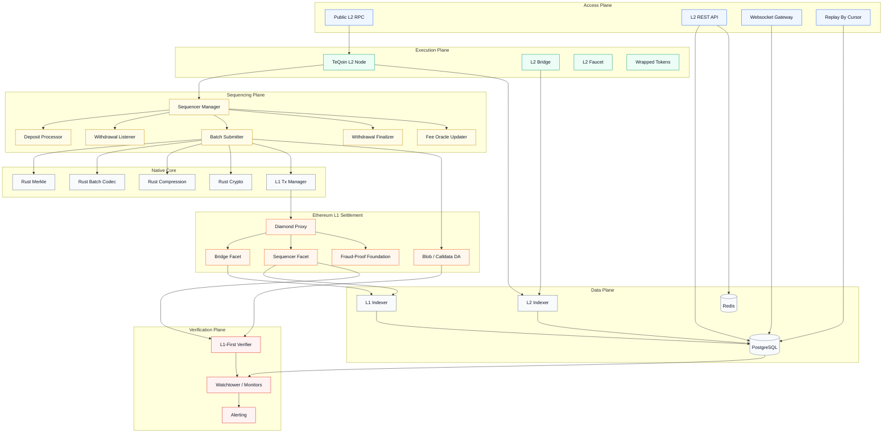
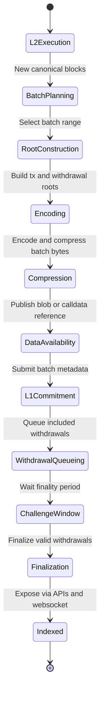
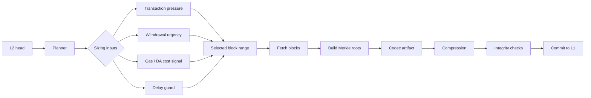
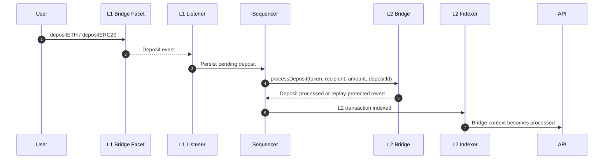
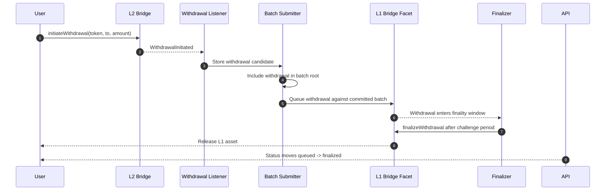
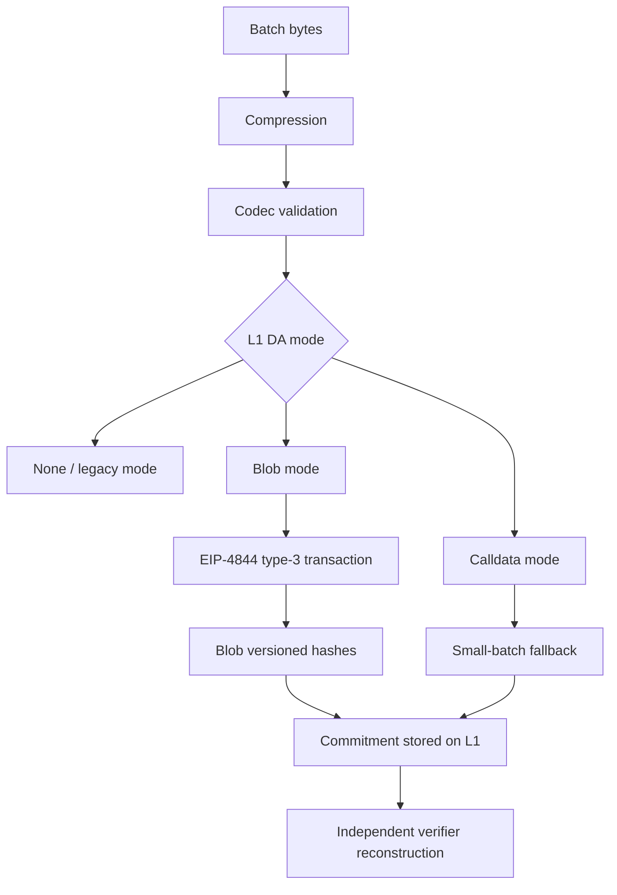
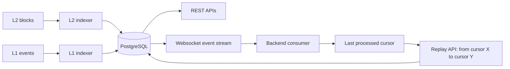
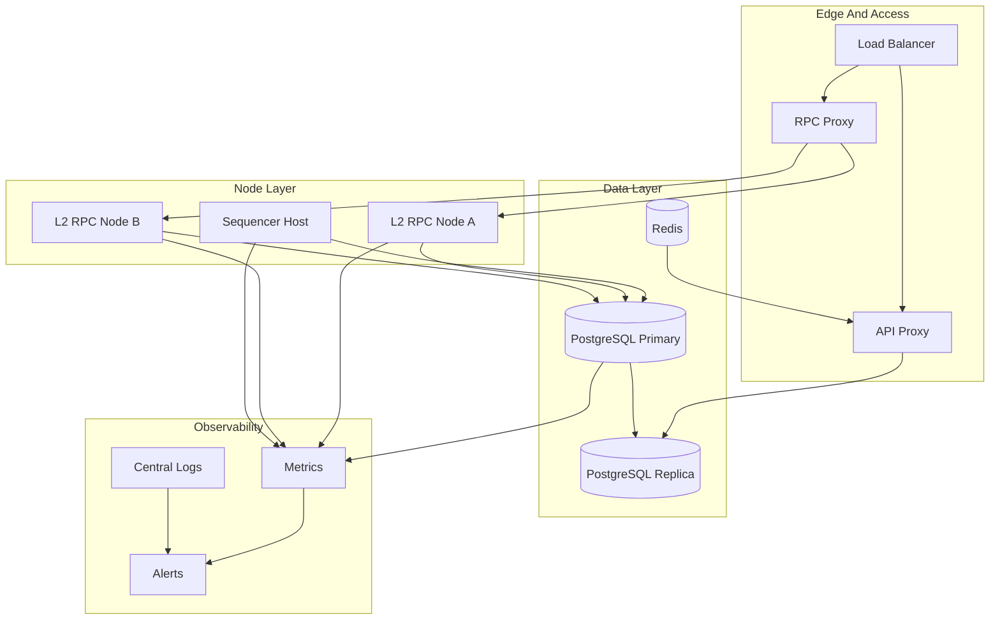

# TeQoin Architecture

This document describes the TeQoin L2 architecture for protocol engineers, infrastructure partners, auditors, backend developers, frontend integrators, and node operators.

## Architecture Summary

TeQoin is organized around six core planes:

| Plane | Responsibility |
| --- | --- |
| Access plane | Public RPC, REST APIs, websocket feeds, replay recovery, and external integrations. |
| Execution plane | EVM-compatible L2 block production, state transition, transaction inclusion, and L2 contracts. |
| Sequencing plane | Batch planning, deposit processing, withdrawal tracking, DA publishing, L1 submission, and signer coordination. |
| Settlement plane | Ethereum L1 diamond contracts, bridge custody, batch commitments, finality, and DA references. |
| Data plane | PostgreSQL, Redis where used, indexers, bridge lifecycle records, cursor replay, and analytics. |
| Verification plane | Merkle checks, codec checks, DA verification, challenger/verifier foundations, monitoring, and audit trails. |

## Full System Diagram

## Protocol Lifecycle

## Batch Construction Detail

| Stage | Output | Main Risk | Control |
| --- | --- | --- | --- |
| Planning | Batch start/end | Too small, too large, or delayed batch | Smart sizing, max range, urgency guard |
| Rooting | Transaction and withdrawal roots | Incorrect or stale Merkle root | Rust Merkle with fallback/shadow checks |
| Encoding | Canonical batch artifact | Incompatible wire format | Rust batch codec validation |
| Compression | Compressed bytes | Non-reconstructable artifact | Zstd round-trip validation |
| DA | Blob/calldata reference | Missing or mismatched data | DA commitment and verifier path |
| L1 commit | Batch metadata | Invalid continuity or permissions | Sequencer facet checks and monitoring |

## Bridge Lifecycle Detail

### Deposit Path

### Withdrawal Path

## Data Availability Modes

| Mode | Intended Use | Production Notes |
| --- | --- | --- |
| None / legacy | Controlled compatibility and migration paths. | Should not be allowed past mandatory DA activation for production batches. |
| Calldata | Small-batch fallback and emergency compatibility. | Expensive and not viable for large batches. |
| Blob | Canonical scalable DA path. | Requires lifecycle tracking, beacon verification, fee monitoring, and mismatch alerts. |

## Indexer And Websocket Recovery

The websocket design assumes consumers persist the last processed cursor. If they disconnect, they can recover the exact missed range through the replay API instead of relying on best-effort live delivery.

## Operational Topology

## Trust Boundaries And Controls

| Boundary | Risk | Expected Control |
| --- | --- | --- |
| Public RPC | Unsafe JSON-RPC methods, high-cardinality requests, DoS. | Proxy filtering, safe namespaces, rate limits, monitoring. |
| Sequencer signer | Key compromise, nonce collision, insufficient funding. | Key separation, signer monitoring, replacement policy, restricted env handling. |
| L1 owner/admin | Unsafe upgrade or emergency operation. | Multisig/timelock path, audit trail, runbooks, selector checks. |
| DA commitment | Missing, mismatched, or unverifiable batch data. | Blob hash binding, lifecycle state machine, beacon verification, alerts. |
| Bridge withdrawals | Invalid batch affecting withdrawal finality. | Withdrawal root binding, challenge window, invalidated batch checks. |
| Indexer data | Lost websocket events or stale API responses. | Durable DB, cursor replay, lag metrics, endpoint timing alerts. |

## Production Readiness Focus Areas

| Area | Target |
| --- | --- |
| DA enforcement | Blob DA permanently enabled only after repeated controlled verification and monitoring green state. |
| Independent verification | Batch reconstruction from L1-available data without trusting local artifacts. |
| Fraud proofs | Move from foundation-level dispute wiring toward full deterministic execution and fault-proof VM path. |
| Fee accounting | Shadow accounting for real DA cost versus L2 fee charged, then enforcement in transaction admission. |
| Governance | Multisig/timelock, role separation, deployment checklist, and emergency runbooks. |
| External audit | Contract scope, storage diffs, ABIs, deployment records, test reports, and known limitations documented. |
