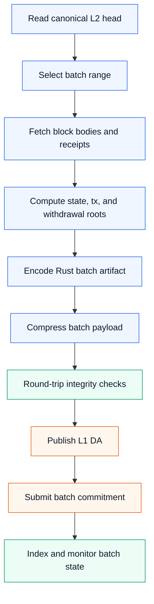
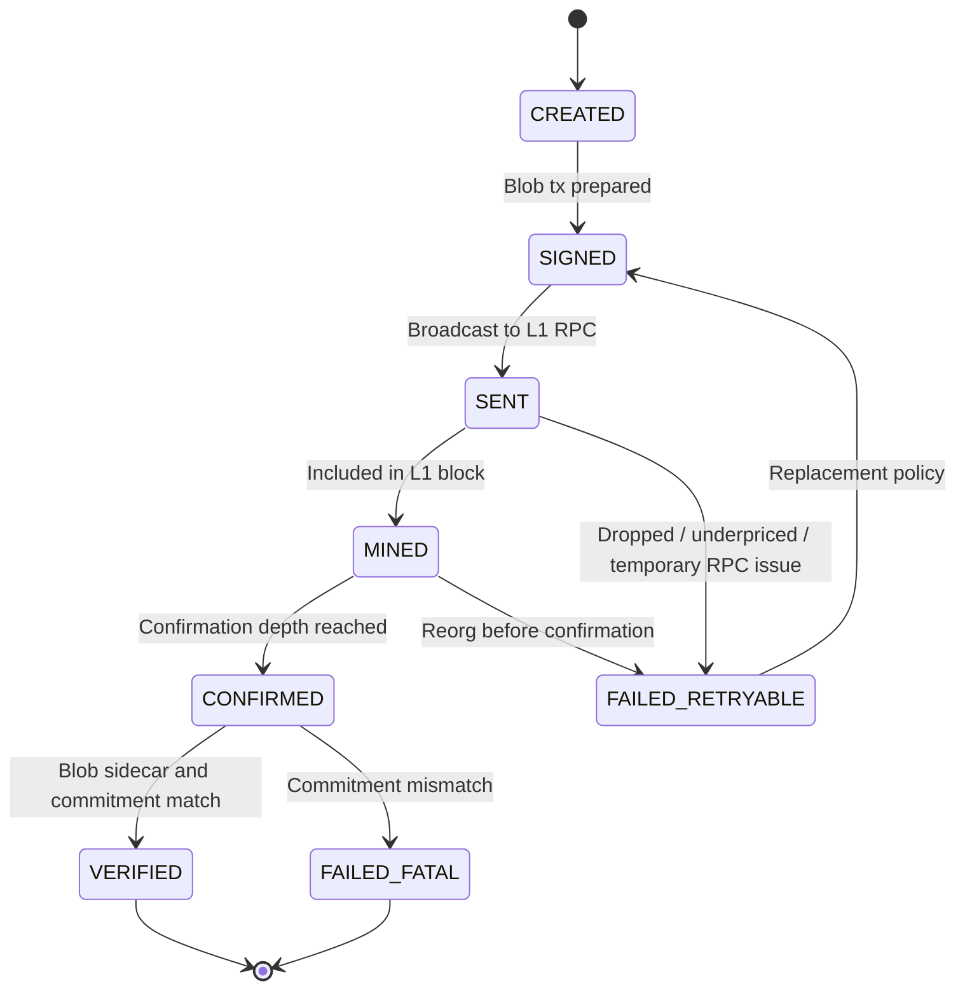
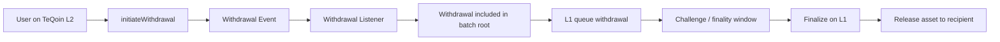
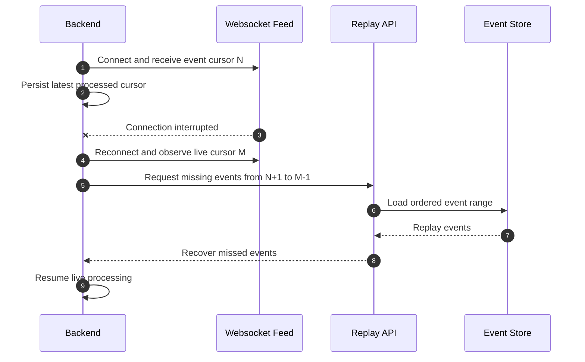
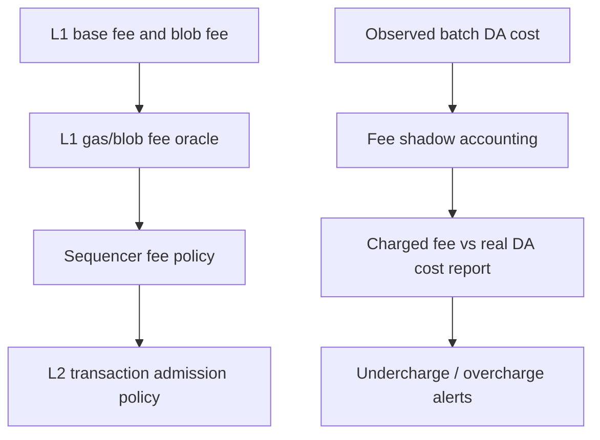
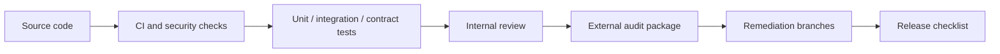

# TeQoin Protocol Flows

This document gives reviewers and integrators a visual map of the major TeQoin protocol flows. It is intentionally focused on lifecycle and control flow rather than implementation details.

## 1. L2 Transaction Flow

## 2. Batch Commitment Flow

## 3. Blob DA Lifecycle

## 4. Deposit Flow

```mermaid
flowchart LR
  L1User[User on Ethereum L1] --> L1Bridge[Deposit on L1 Bridge]
  L1Bridge --> Event[Deposit Event]
  Event --> L1Listener[L1 Deposit Listener]
  L1Listener --> Queue[Deposit Queue]
  Queue --> Processor[L2 Deposit Processor]
  Processor --> L2Bridge[L2 Bridge processDeposit]
  L2Bridge --> Balance[Recipient credited on L2]
  Balance --> API[Bridge API status: processed]
```

## 5. Withdrawal Flow

## 6. Websocket Recovery Flow

## 7. Fee Accounting Flow

## 8. Security Review Flow

